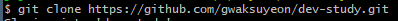

## Git 사용법

### Git이란

- souce 관리를 위한 분산 버전 관리 시스템

### Git 흐름도

- local - 현재 사용하고 있는 컴퓨터
- remote - 원격 저장소
- working directory - 현재 사용하고 있는 작업 디렉토리
- staging area - 파일의 변경사항 추적 가능 및 임시 저장 개념
- local repo - 최종적으로 컴퓨터에 저장하는 저장소

### Git 명령어

1. git init
   - git 생성
2. git clone 원격 저장소 주소
   - 원격 저장소에서 코드 가져오기
   - 
3. git init
   - git 생성
4. git status
   - git 현재 상태 확인
5. git add
   - 파일을 staging area로 이동
6. git commit
   - staging area에서 local repo로 이동
7. git push
   - 원격 저장소로 저장
8. git branch 브랜치명
   - 브랜치 생성하기
9. git checkout 브랜치명
   - 브랜치 선택하기
10. git fetch
    - 서버에서 최신 코드 받아오기
11. git pull
    - 서버에서 최신코드를 받아와 merge
12. git merge 병합할 브랜치명
    - 병합할 브랜치를 현재 브랜치로 merge