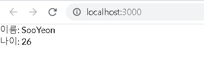

# RestCall - Axios

Rest API 호출시 React에서는 axios module 을 이용한다

### 모듈 설치 과정

1. axios 설치

   `yarn add axios`

2.  모듈화를 위한 디렉토리 정리

   src/service

3.  get 하기 위한 함수 설정

   ```javascript
   export function getUser() {
     return axios.get('http://localhost:8080/user');
   }
   ```

4.  app.tsx에서 실행

   ```javascript
   import React from 'react';
   import * as service from '../src/services/user';
   
   class App extends React.Component {
   
     state = {
       name: '',
       age: 0,
     }
   
     componentDidMount() {
       this.fetchUserInfo();
     }
     
     fetchUserInfo = async () => {
       const user = await Promise.all([
         service.getUser(),
       ])
   
       this.setState({
         name: user[0].data.name,
         age: user[0].data.age,
       })
     }
   
     render() {
       return (
         <div id="App">
           이름: {this.state.name}<br/>
           나이: {this.state.age}
         </div>
       )
     }
   }
   
   export default App;
   
   ```

5.  결과

   